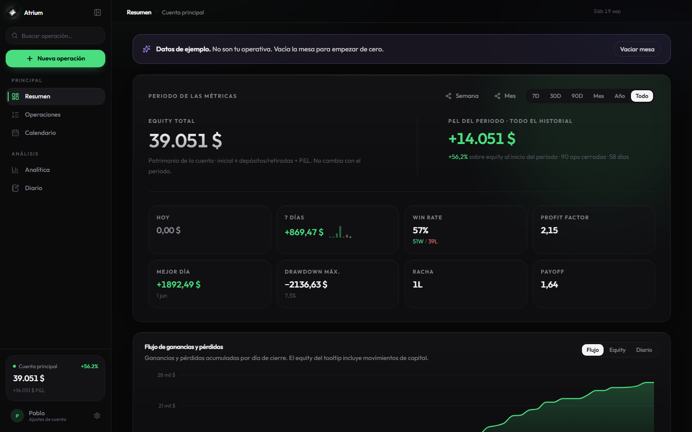
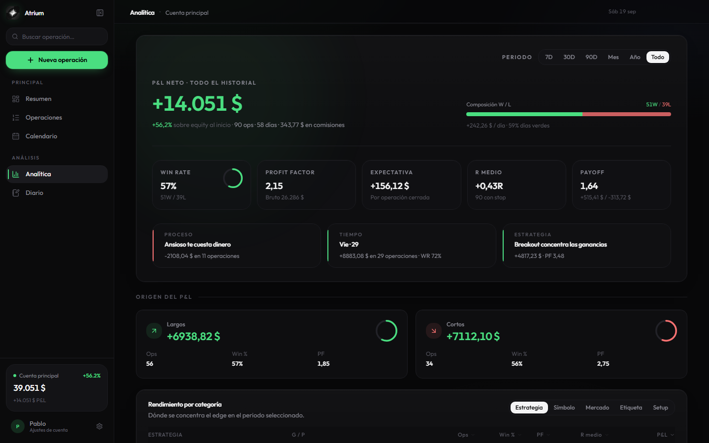
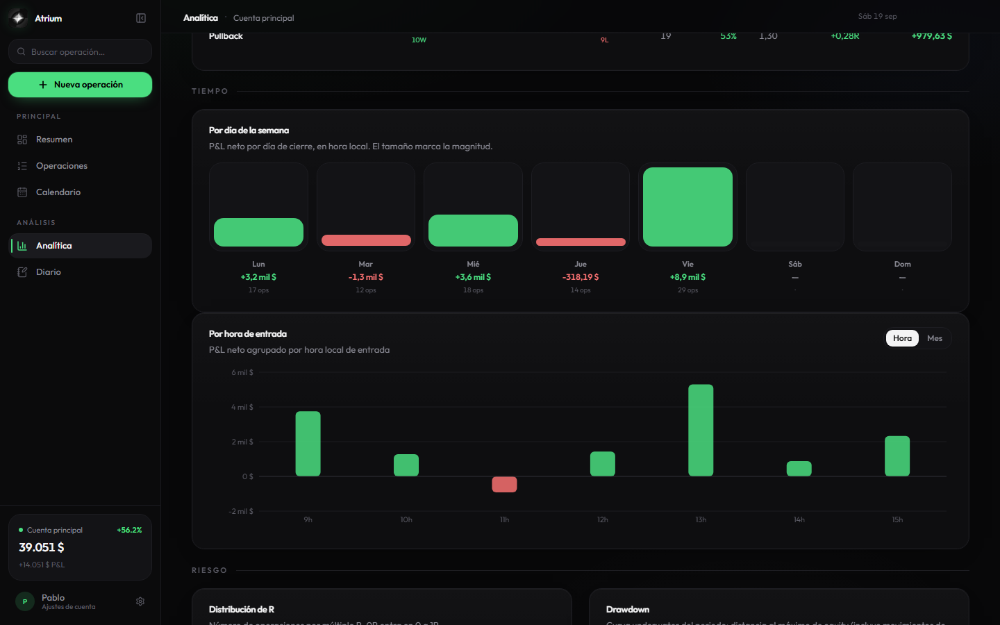
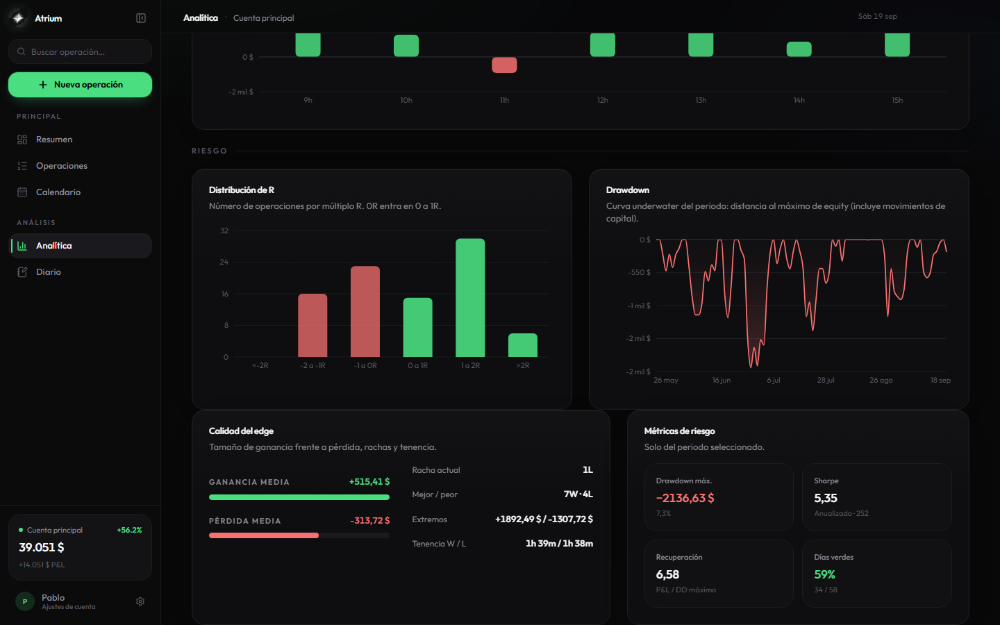
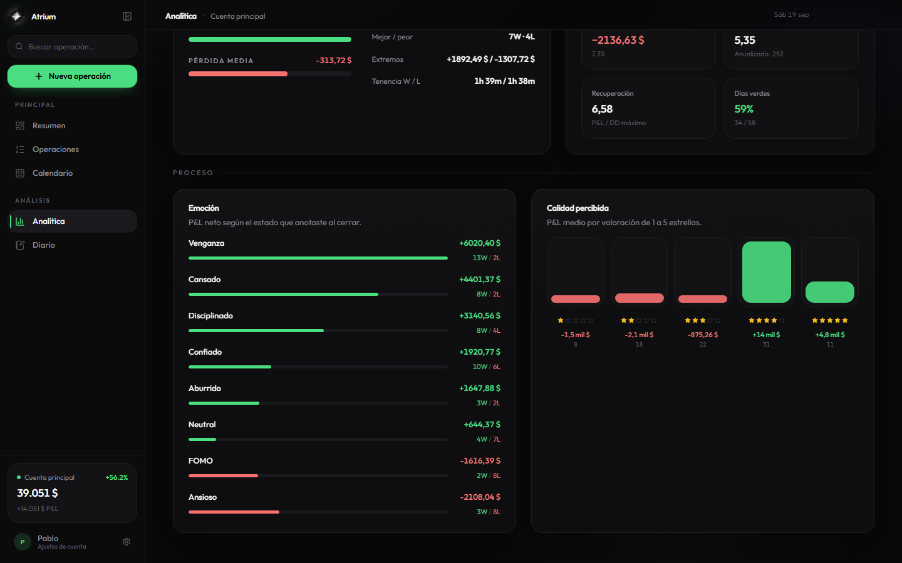
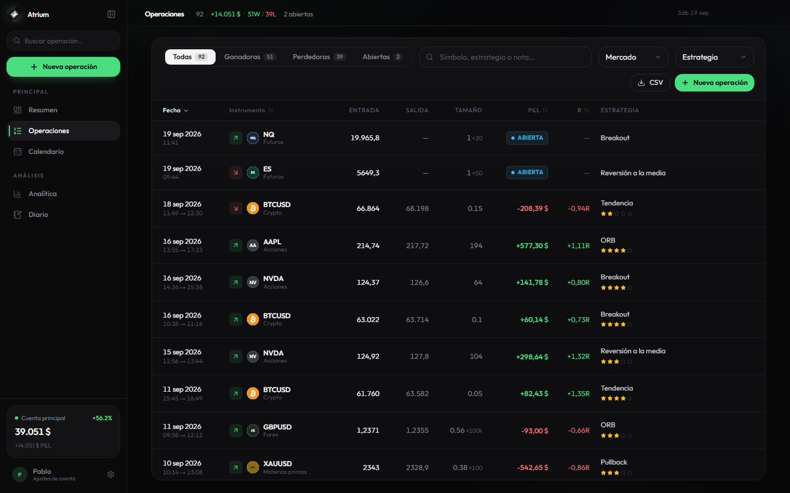
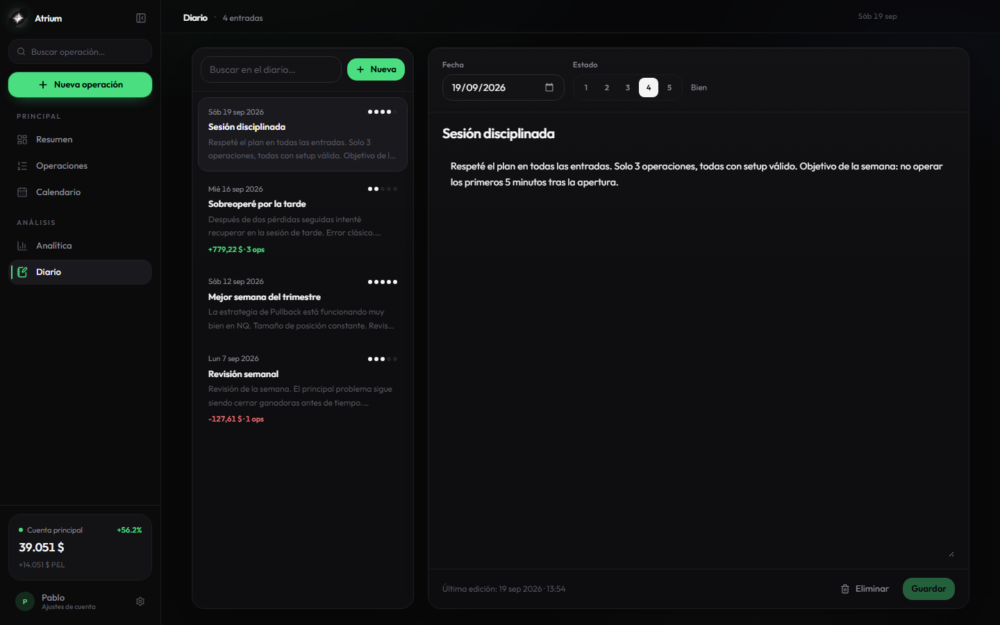
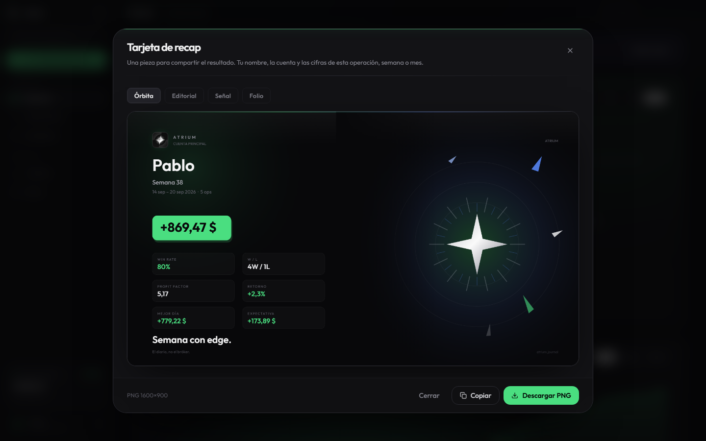

<p align="center">
  
</p>

<h1 align="center">Atrium</h1>

<p align="center">
  <em>The trading journal built for process — not just P&amp;L.</em><br/>
  <em>El diario de trading pensado para el proceso — no solo para el resultado.</em>
</p>

<p align="center">
  
  
  
  
  
</p>

<br/>

<p align="center">
  
</p>

<p align="center">
  <sub>
    <strong>Dashboard</strong> — equity, KPIs and P&amp;L flow at a glance<br/>
    <strong>Resumen</strong> — equity, KPIs y flujo de P&amp;L de un vistazo
  </sub>
</p>

<p align="center">
  <a href="#product-tour--recorrido-del-producto">Product tour</a>
  ·
  <a href="#english">English docs</a>
  ·
  <a href="#español">Docs en español</a>
  ·
  <a href="docs/README.md">Full documentation</a>
</p>

---

## Why Atrium · Por qué Atrium

<table>
<tr>
<td width="50%" valign="top">

**English**

Atrium is a desktop trading journal for serious process work: multi-account books, broker import, deep analytics, psychology notes and shareable recap cards — offline-first, with optional cloud sync.

</td>
<td width="50%" valign="top">

**Español**

Atrium es un diario de trading de escritorio para el proceso en serio: varias cuentas, importación de bróker, analítica profunda, notas psicológicas y tarjetas de recap — primero local, con sync opcional en la nube.

</td>
</tr>
</table>

| | Capability · Capacidad |
|:--:|:--|
| **01** | Multi-account books — live, demo, prop, paper |
| **02** | Broker CSV / XLSX — XTB, IBKR, DEGIRO + auto-detect |
| **03** | Analytics — win rate, PF, expectancy, R, drawdown, emotions |
| **04** | Calendar heatmap + psychology journal |
| **05** | Share cards 1600×900 — Orbit, Editorial, Signal, Folio |
| **06** | Optional E2E-encrypted multi-device sync (Supabase blobs) · EN / ES |

---

## Product tour · Recorrido del producto

Capturas reales de la app en ejecución.  
*Real screenshots from the running application.*

<br/>

### Analytics · Analítica

Deep edge measurement across the whole book — not a single KPI strip.  
*Medición profunda de la ventaja en todo el libro — no solo una franja de KPIs.*

| Block · Bloque | What you see · Qué ves |
|----------------|------------------------|
| **Overview** | Net P&L, win rate, profit factor, expectancy, avg R, payoff |
| **Insights** | Auto highlights — process leaks, best weekday, leading strategy |
| **P&L origin** | Long vs short contribution |
| **By category** | Strategy · symbol · market · tag · setup |
| **Time** | Weekday, hour-of-day, monthly seasonality |
| **Risk** | R-distribution, drawdown curve, streaks, Sharpe, recovery |
| **Process** | Emotions, perceived quality, mistake tags |

<p align="center">
  
</p>

<p align="center">
  <sub>
    <strong>EN</strong> — hero KPIs, smart insights, long/short origin and category table<br/>
    <strong>ES</strong> — KPIs, insights, origen long/short y tabla por categoría
  </sub>
</p>

<p align="center">
  
</p>

<p align="center">
  <sub>
    <strong>EN</strong> — when the edge shows up (weekday · hour · month)<br/>
    <strong>ES</strong> — cuándo aparece la ventaja (día · hora · mes)
  </sub>
</p>

<p align="center">
  
</p>

<p align="center">
  <sub>
    <strong>EN</strong> — R histogram, drawdown, streak quality and risk metrics<br/>
    <strong>ES</strong> — histograma en R, drawdown, calidad de rachas y métricas de riesgo
  </sub>
</p>

<p align="center">
  
</p>

<p align="center">
  <sub>
    <strong>EN</strong> — emotions, star ratings and mistake tags vs P&amp;L<br/>
    <strong>ES</strong> — emociones, estrellas y etiquetas de error frente al P&amp;L
  </sub>
</p>

Full write-up: [Features → Analytics](docs/en/FEATURES.md#4-analytics) · [Funciones → Analítica](docs/es/FUNCIONES.md#4-analítica)

<br/>

### Calendar · Calendario

Month heatmap by P&amp;L, with day detail and journal context.  
*Mapa de calor mensual por P&amp;L, con detalle del día y contexto del diario.*

<p align="center">
  
</p>

<br/>

### Trades · Operaciones

Searchable trade book — filters, strategies, tags, expand-to-edit.  
*Libro de operaciones con búsqueda, filtros, estrategias, tags y edición.*

<p align="center">
  
</p>

<br/>

### Journal · Diario

Mood-tagged session notes linked to trading days.  
*Notas de sesión con estado de ánimo, vinculadas a cada día de trading.*

<p align="center">
  
</p>

<br/>

### Import · Importación

JSON backups and broker CSV/XLSX — XTB, Interactive Brokers, DEGIRO, Fomo, Axiom, auto-detect.  
*Copias JSON y CSV/XLSX de bróker — XTB, Interactive Brokers, DEGIRO, Fomo, Axiom, auto-detección.*

<p align="center">
  
</p>

<br/>

### Share cards · Tarjetas

Week, month or single-trade recaps ready to download as PNG 1600×900.  
*Recaps de semana, mes u operación listos para descargar en PNG 1600×900.*

<p align="center">
  
</p>

---

<a id="english"></a>

## English

**Guides:** [Features](docs/en/FEATURES.md) · [Getting started](docs/en/GETTING_STARTED.md) · [Import](docs/en/IMPORT.md) · [Architecture](docs/en/ARCHITECTURE.md) · [Screenshots](docs/en/SCREENSHOTS.md)

### Quick start

```bash
npm install
cp .env.example .env   # optional — FMP logos; Supabase only if you want encrypted cloud sync
npm run dev            # Vite + Electron
```

Windows shortcut: double-click **`Abrir Atrium.bat`**.

| Command | What it does |
|---------|----------------|
| `npm run dev` | Development (Vite + Electron) |
| `npm run build` | Production web bundle |
| `npm run dist` | Windows installer → `release/` |
| `npm run typecheck` | TypeScript check |
| `npm run test` | Vitest unit tests (crypto, repository, sync) |
| `npm run test:import` | Import engine tests |
| `npm run shots` | Regenerate real README screenshots |

### Environment

| Variable | Required | Purpose |
|----------|:--------:|---------|
| `VITE_SUPABASE_URL` | — | Optional — enable Settings › Multi-device sync (E2E encrypted) |
| `VITE_SUPABASE_ANON_KEY` | — | Supabase anon key (never `service_role`) |
| `VITE_FMP_API_KEY` | — | Ticker logos (Financial Modeling Prep) |

### Stack

`React 19` · `TypeScript` · `Vite 8` · `Tailwind CSS 4` · `Zustand` · `Electron 44` · `Recharts` · `xlsx` · `Supabase` (optional)

### Shortcuts

| Key | Action |
|-----|--------|
| `1`–`6` | Switch pages |
| `Ctrl/Cmd + N` | New trade |
| `Ctrl/Cmd + B` | Toggle sidebar |

---

<a id="español"></a>

## Español

**Guías:** [Funciones](docs/es/FUNCIONES.md) · [Primeros pasos](docs/es/PRIMEROS_PASOS.md) · [Importación](docs/es/IMPORTACION.md) · [Arquitectura](docs/es/ARQUITECTURA.md) · [Capturas](docs/es/CAPTURAS.md)

### Inicio rápido

```bash
npm install
cp .env.example .env   # opcional — logos FMP; Supabase solo si quieres sync cifrado en la nube
npm run dev            # Vite + Electron
```

Atajo Windows: doble clic en **`Abrir Atrium.bat`**.

| Comando | Qué hace |
|---------|----------|
| `npm run dev` | Desarrollo (Vite + Electron) |
| `npm run build` | Bundle web de producción |
| `npm run dist` | Instalador Windows → `release/` |
| `npm run typecheck` | Comprobación TypeScript |
| `npm run test` | Tests unitarios Vitest (cifrado, repository, sync) |
| `npm run test:import` | Tests del motor de importación |
| `npm run shots` | Regenerar capturas reales del README |

### Variables de entorno

| Variable | Obligatoria | Propósito |
|----------|:-----------:|-----------|
| `VITE_SUPABASE_URL` | — | Opcional — activar Ajustes › Sync multi-dispositivo (cifrado E2E) |
| `VITE_SUPABASE_ANON_KEY` | — | Clave anon de Supabase (nunca `service_role`) |
| `VITE_FMP_API_KEY` | — | Logos de tickers (Financial Modeling Prep) |

### Stack

`React 19` · `TypeScript` · `Vite 8` · `Tailwind CSS 4` · `Zustand` · `Electron 44` · `Recharts` · `xlsx` · `Supabase` (opcional)

### Atajos

| Tecla | Acción |
|-------|--------|
| `1`–`6` | Cambiar de página |
| `Ctrl/Cmd + N` | Nueva operación |
| `Ctrl/Cmd + B` | Mostrar / ocultar barra lateral |

---

## Repository layout · Estructura

```text
atrium/
├── electron/           Desktop shell · persistence · backups
├── src/
│   ├── pages/          Dashboard · Trades · Calendar · Analytics · Journal · Settings
│   ├── components/     Design system · charts · ShareCard · Tour
│   ├── lib/import/     Broker adapters · CSV / XLSX pipeline
│   ├── auth/           Optional login when cloud sync is enabled
│   └── assets/         Brand mark
├── prisma/             Cloud schema
├── supabase/           Migrations + RLS (004 = encrypted_sync_snapshots)
├── docs/               Bilingual docs + screenshot gallery
├── scripts/            Launcher · verification · capture-screenshots
└── public/             App icons
```

---

<p align="center">
  
</p>

<p align="center">
  <strong>Pablo Sanz</strong> · Atrium <code>v1.0.0</code><br/>
  <sub>Built for serious traders · Hecho para traders serios</sub>
</p>
