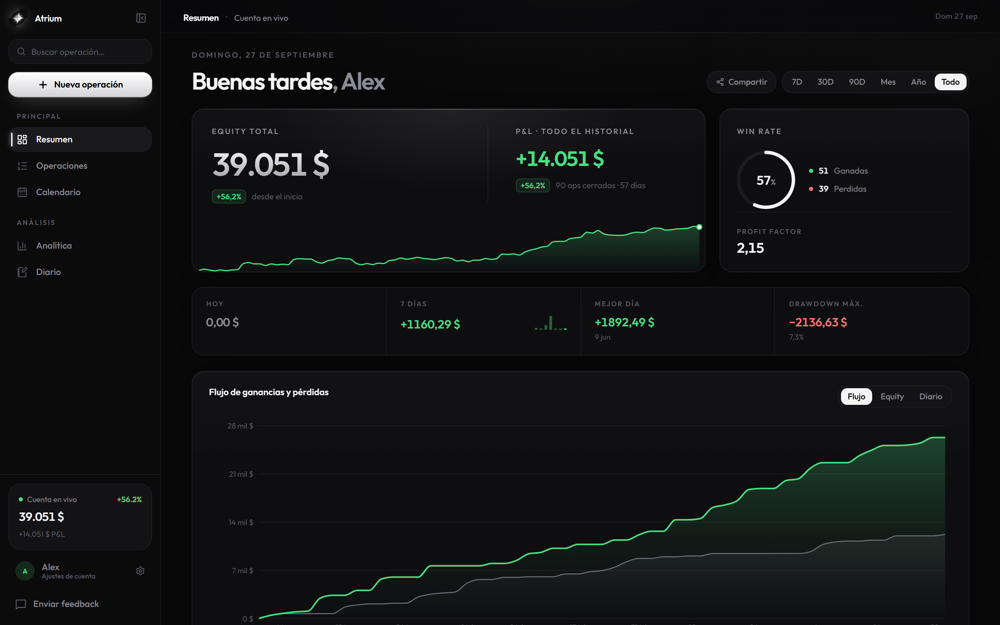
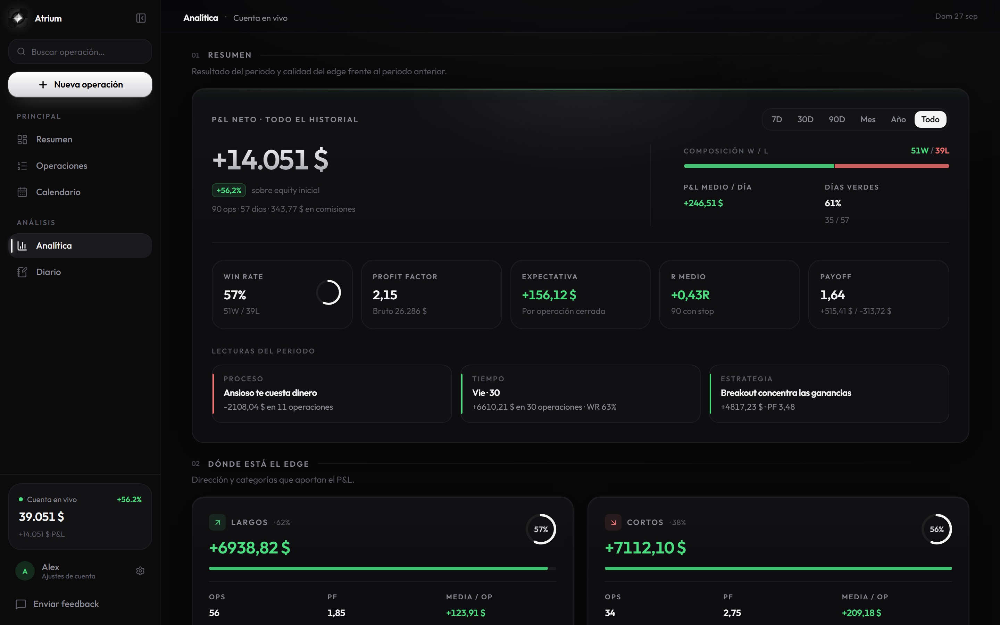
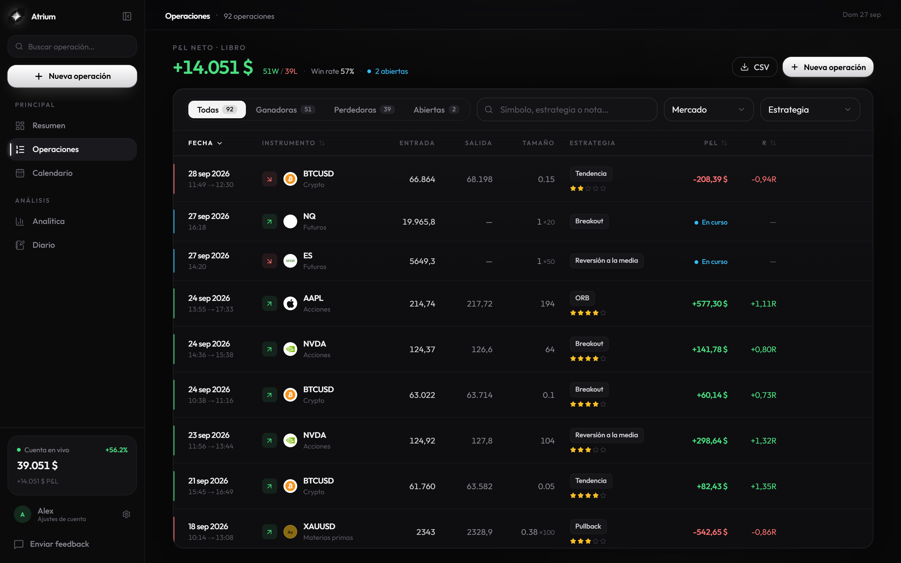
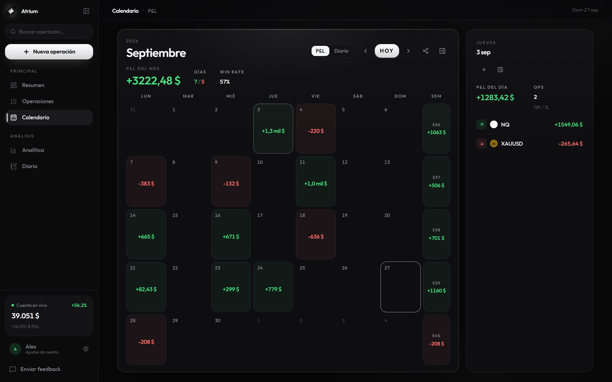

<p align="center">
  
</p>

<h1 align="center">Atrium</h1>

<p align="center">
  <strong>The desktop trading journal that stays on your machine.</strong><br/>
  <em>El diario de trading que se queda en tu equipo.</em>
</p>

<p align="center">
  Encrypted by default · Local-first · No account required · English / Español
</p>

<p align="center">
  <a href="https://github.com/Paablo7766/atrium/releases"></a>
  
  
  
</p>

<p align="center">
  <a href="https://github.com/Paablo7766/atrium/releases">Download for Windows</a>
  ·
  <a href="docs/en/GETTING_STARTED.md">Get started</a>
  ·
  <a href="docs/es/PRIMEROS_PASOS.md">Empezar</a>
  ·
  <a href="docs/README.md">Docs</a>
</p>

<br/>

<p align="center">
  
</p>

<p align="center"><sub>Overview — equity, risk and P&amp;L in one desk.</sub></p>

---

## Why Atrium

Atrium is a **Windows desktop** journal for traders who measure process, not just the last result. Several accounts, broker import, edge analytics and a psychology log — all in an encrypted SQLite file on your disk.

Nothing is uploaded unless you turn that on. There is no Atrium cloud account holding your book.

Atrium es un diario de escritorio: varias cuentas, importación de bróker y analítica, en SQLite cifrado. Nada se sube si tú no lo activas. Atrium no custodia tu libro.

## About this project · Sobre el proyecto

Atrium is built and maintained by **one developer** (Pablo Sanz) in spare time — not a company roadmap. **Replies, bug fixes, and new features may take a while**; there is no SLA.

**Feedback:** use the in-app **Send feedback** flow (Settings or sidebar). Reports go to the same beta channel (Discord) as suggestions and bugs — no separate forum required. For security issues, see [SECURITY.md](SECURITY.md) (private report before a public issue).

Atrium lo mantiene **una sola persona** en tiempo libre. Las respuestas y las funciones pueden tardar. El canal de feedback es el modal **Enviar feedback** de la app (Discord). Vulnerabilidades: [SECURITY.md](SECURITY.md).

| | What you get |
|:--:|:--|
| **Local-first** | Works offline. No sign-in to journal. |
| **Encrypted at rest** | `journal.db` is SQLCipher (AES-256). A forgotten master password cannot be recovered. |
| **Zero custody** | Atrium never stores or can read your trades. |
| **Optional backup** | Litestream replica to a folder you choose — still encrypted. |
| **Optional sync** | End-to-end AES-GCM snapshots. The server sees blobs, not a journal. |
| **Private by design** | Product analytics, if enabled, send platform and version only. Never trades or notes. |

---

## Product

<table>
<tr>
<td width="50%" valign="top">

**Analytics** — win rate, profit factor, expectancy, R and process leaks.



</td>
<td width="50%" valign="top">

**Trades** — the book, with search, filters and broker import.



</td>
</tr>
</table>

<p align="center">
  
</p>

<p align="center"><sub>Calendar — the month as a heatmap. Open a day, see the session.</sub></p>

Also included: live / demo / prop / paper accounts, psychology notes on trading days, and recap cards (1600×900) when you want to share a week.

Full catalogue: [Features](docs/en/FEATURES.md) · [Funciones](docs/es/FUNCIONES.md)

---

## Get started

```bash
npm install
npm run dev
```

No `.env` is required. The journal is local and encrypted. Double-click `Abrir Atrium.bat` on Windows if you prefer.

| Command | |
|---------|---|
| `npm run dev` | Desktop development |
| `npm run dist` | Windows installer → `release/` |
| `npm run test` | Unit tests (crypto, repository, sync) |

Optional `.env` is only for ticker logos or anonymous usage telemetry. Multi-device cloud sync exists in code but is **off** in this release. Web preview uses encrypted IndexedDB, not the desktop SQLCipher journal. See [Getting started](docs/en/GETTING_STARTED.md) · [Primeros pasos](docs/es/PRIMEROS_PASOS.md).

---

## Documentation

| English | Español |
|---------|---------|
| [Features](docs/en/FEATURES.md) | [Funciones](docs/es/FUNCIONES.md) |
| [Getting started](docs/en/GETTING_STARTED.md) | [Primeros pasos](docs/es/PRIMEROS_PASOS.md) |
| [Import](docs/en/IMPORT.md) | [Importación](docs/es/IMPORTACION.md) |
| [Architecture](docs/en/ARCHITECTURE.md) | [Arquitectura](docs/es/ARQUITECTURA.md) |
| [Backup & encryption](docs/BACKUP_ARCHITECTURE.md) | [Copias y cifrado](docs/BACKUP_ARCHITECTURE.md) |

---

<p align="center">
  
</p>

<p align="center">
  <strong>Atrium</strong> · Pablo Sanz<br/>
  <sub>Your process. Your machine. Your keys.</sub>
</p>
