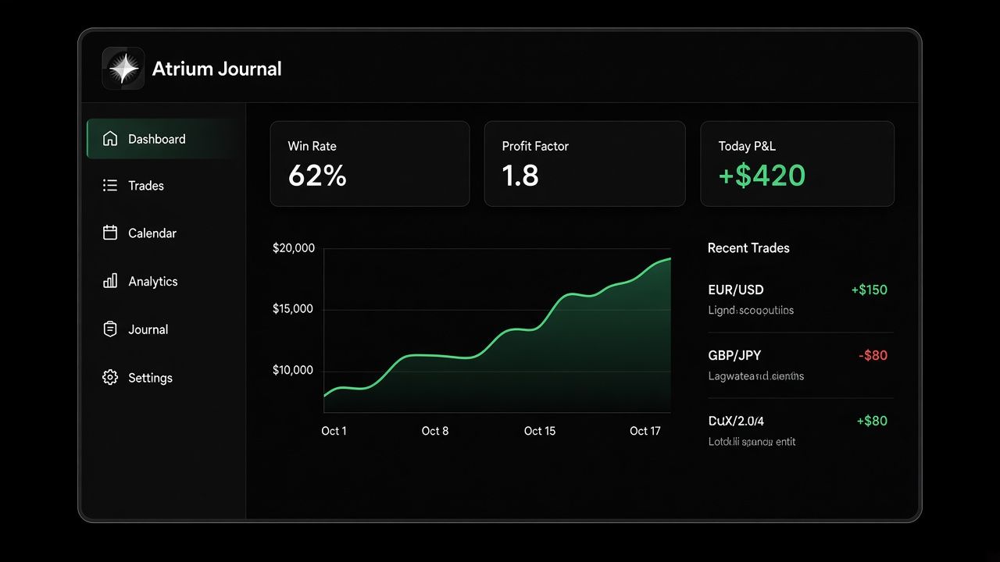
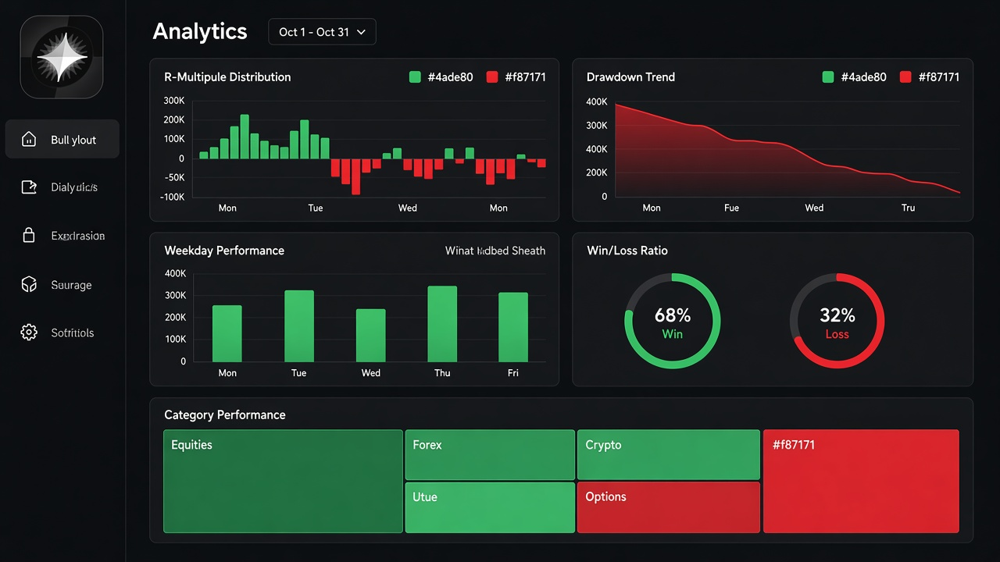
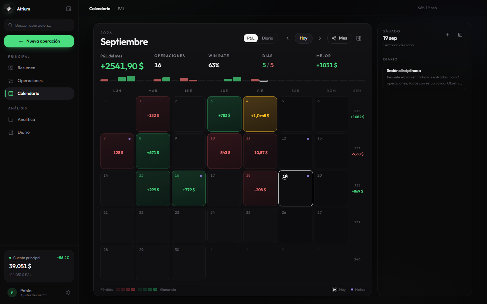
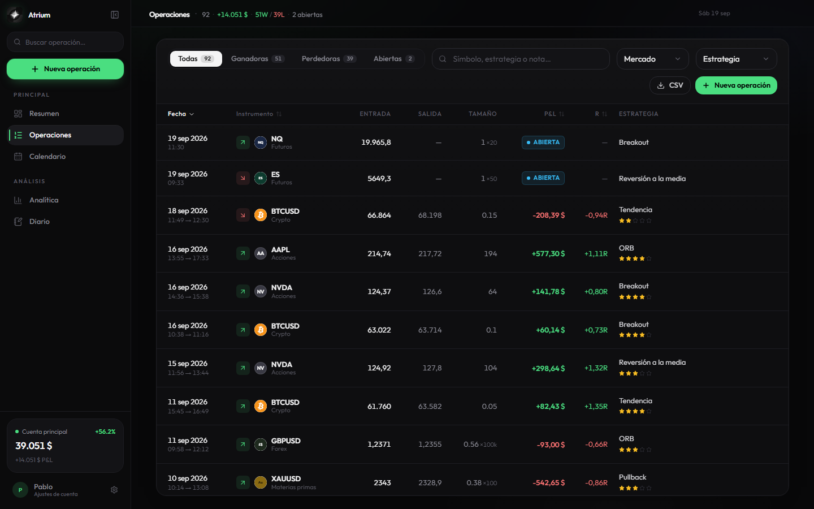
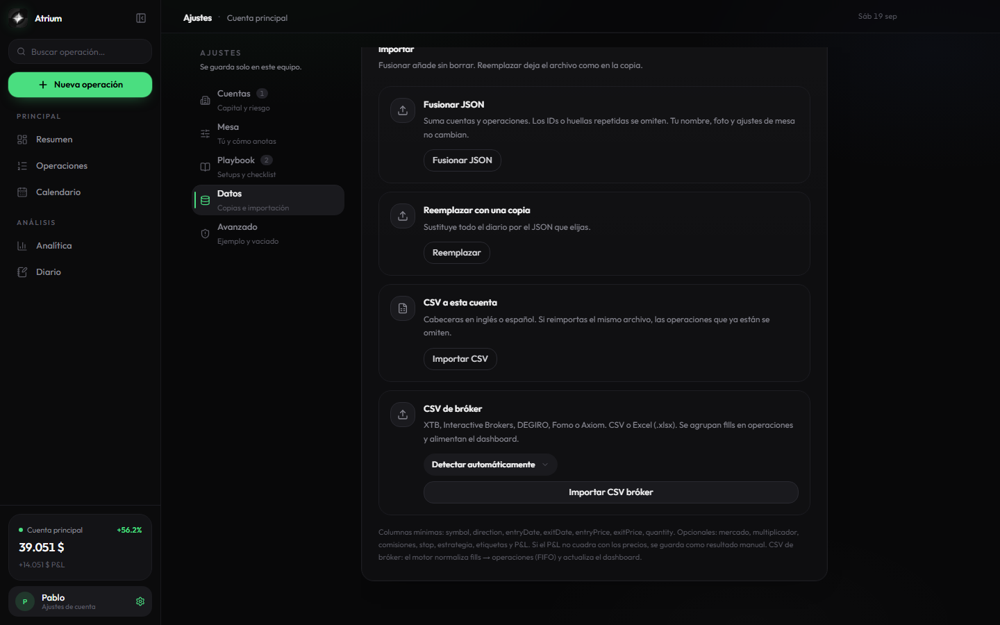

# Screenshots

Real captures from the running Atrium app (`npm run shots`).

| Screen | File | What it shows |
|--------|------|----------------|
| **Dashboard** | [hero-dashboard.png](../assets/hero-dashboard.png) | Equity, KPIs, P&L flow |
| **Analytics** | [feature-analytics.png](../assets/feature-analytics.png) | Edge metrics, insights, long/short origin |
| **Calendar** | [feature-calendar.png](../assets/feature-calendar.png) | Monthly P&L heatmap + day panel |
| **Trades** | [feature-trades.png](../assets/feature-trades.png) | Trade book, filters, strategies |
| **Journal** | [feature-journal.png](../assets/feature-journal.png) | Mood-tagged session notes |
| **Import** | [feature-import.png](../assets/feature-import.png) | Backups + broker CSV import |
| **Share card** | [feature-share-card.png](../assets/feature-share-card.png) | Recap card export (PNG 1600×900) |

### Dashboard

### Analytics

### Calendar

### Trades

### Journal

### Import

### Share card

---

[← Documentation index](../README.md) · [← Root README](../../README.md)
