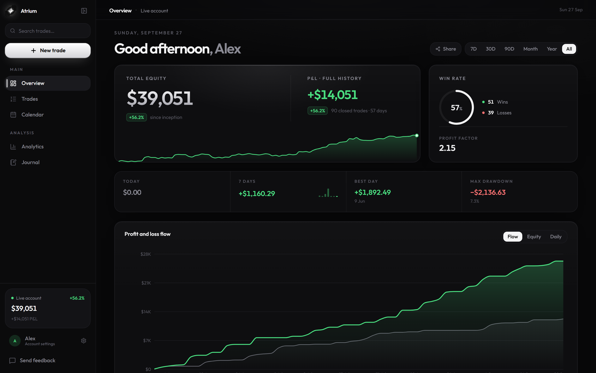
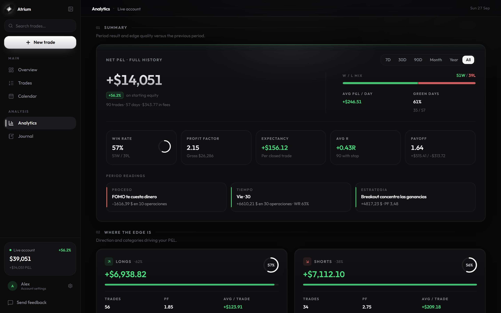
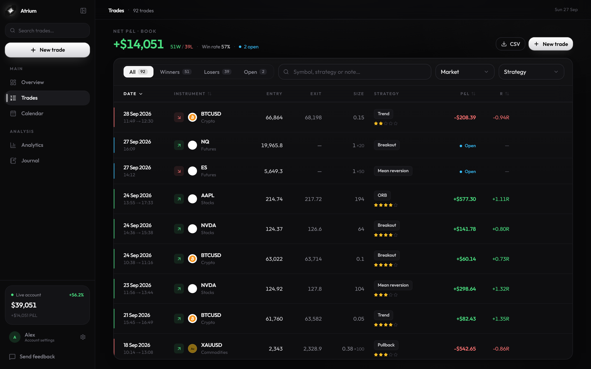
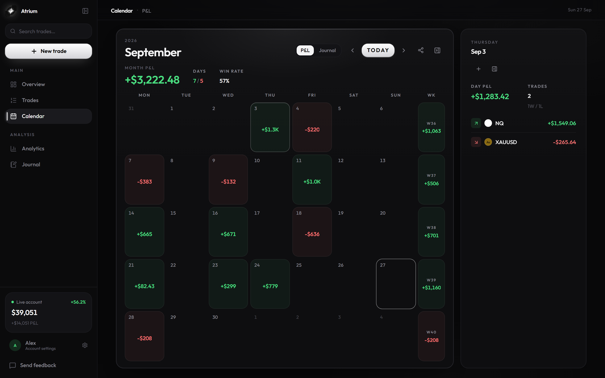

# Screenshots

The four product shots used on the GitHub README (`npm run shots`).

| Screen | File | What it shows |
|--------|------|----------------|
| **Overview** | [dashboard.png](../assets/dashboard.png) | Equity, KPIs, P&L |
| **Analytics** | [analytics.png](../assets/analytics.png) | Edge reading of the book |
| **Trades** | [trades.png](../assets/trades.png) | The trade book |
| **Calendar** | [calendar.png](../assets/calendar.png) | Monthly heatmap + day panel |

### Overview

### Analytics

### Trades

### Calendar

Regenerate with `npm run dev:web`, then `npm run shots`.

---

[← Documentation index](../README.md) · [← Root README](../../README.md)
